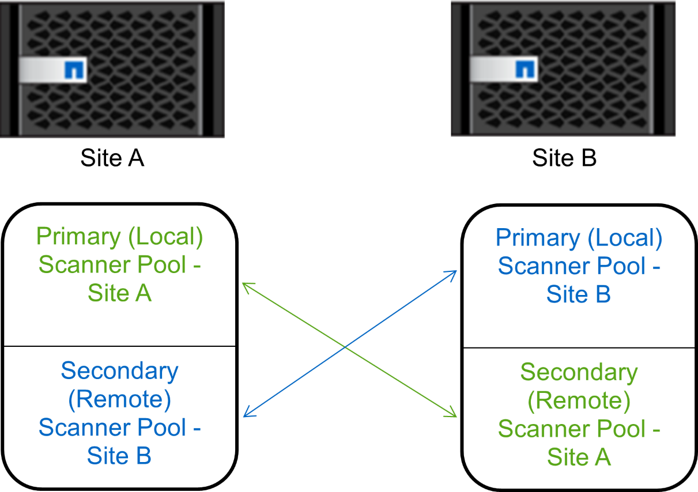

= 在 MetroCluster 配置中创建扫描程序池
:allow-uri-read: 
:icons: font
:imagesdir: ../media/

[role="lead"]
您必须在 MetroCluster 配置中的每个集群上创建主和二级扫描程序池，这些池对应于集群上的主和二级 SVM 。

.您需要的内容
* SVM 和 Vscan 服务器必须位于同一域或受信任域中。
* 对于为单个SVM定义的扫描程序池、您必须已为ONTAP防病毒连接器配置SVM管理LIF或SVM数据LIF。
* 对于为集群中的所有SVM定义的扫描程序池、您必须已使用集群管理LIF配置ONTAP防病毒连接器。
* 有权限的用户列表必须包含 Vscan 服务器用于连接到 SVM 的域用户帐户。
* 配置扫描程序池后、请检查与服务器的连接状态。

.关于此任务
MetroCluster 配置通过实施两个物理上独立的镜像集群来保护数据。每个集群会同步复制另一个集群的数据和 SVM 配置。当集群联机时，本地集群上的主 SVM 将提供数据。当远程集群脱机时，本地集群上的二级 SVM 将提供数据。

这意味着您必须在MetroCluster配置中的每个集群上创建主扫描程序池和二级扫描程序池、当集群开始从二级SVM提供数据时、二级池将变为活动状态。对于灾难恢复(Disaster Recovery、DR)、此配置与MetroCluster类似。

此图显示了典型的MetroCluster/DR配置。

.步骤
. 创建扫描程序池：
+
`vserver vscan scanner-pool create -vserver _data_SVM|cluster_admin_SVM_ -scanner-pool _scanner_pool_ -hostnames _Vscan_server_hostnames_ -privileged-users _privileged_users_`

+
** 为为为单个 SVM 定义的池指定数据 SVM ，并为为为集群中的所有 SVM 定义的池指定集群管理员 SVM 。
** 为每个 Vscan 服务器主机名指定 IP 地址或 FQDN 。
** 为每个有权限的用户指定域和用户名。

+
[NOTE]
====
您必须从包含主 SVM 的集群创建所有扫描程序池。

====
+
有关完整的选项列表，请参见命令手册页。

+
以下命令会在 MetroCluster 配置中的每个集群上创建主扫描程序池和二级扫描程序池：

+
[listing]
----
cluster1::> vserver vscan scanner-pool create -vserver cifssvm1 -
scanner-pool pool1_for_site1 -hostnames scan1 -privileged-users cifs
\u1,cifs\u2

cluster1::> vserver vscan scanner-pool create -vserver cifssvm1 -
scanner-pool pool1_for_site2 -hostnames scan1 -privileged-users cifs
\u1,cifs\u2

cluster1::> vserver vscan scanner-pool create -vserver cifssvm1 -
scanner-pool pool2_for_site1 -hostnames scan2 -privileged-users cifs
\u1,cifs\u2

cluster1::> vserver vscan scanner-pool create -vserver cifssvm1 -
scanner-pool pool2_for_site2 -hostnames scan2 -privileged-users cifs
\u1,cifs\u2
----
. 验证是否已创建扫描程序池：
+
`vserver vscan scanner-pool show -vserver _data_SVM|cluster_admin_SVM_ -scanner-pool _scanner_pool_`

+
有关完整的选项列表，请参见命令手册页。

+
以下命令显示扫描程序池的详细信息 `pool1`：

+
[listing]
----
cluster1::> vserver vscan scanner-pool show -vserver cifssvm1 -scanner-pool pool1_for_site1

                                    Vserver: cifssvm1
                               Scanner Pool: pool1_for_site1
                             Applied Policy: idle
                             Current Status: off
         Cluster on Which Policy Is Applied: -
                  Scanner Pool Config Owner: vserver
       List of IPs of Allowed Vscan Servers:
List of Host Names of Allowed Vscan Servers: scan1
                   List of Privileged Users: cifs\u1,cifs\u2
----
+
您也可以使用 `vserver vscan scanner-pool show` 命令以查看SVM上的所有扫描程序池。有关完整的命令语法，请参见命令手册页。

