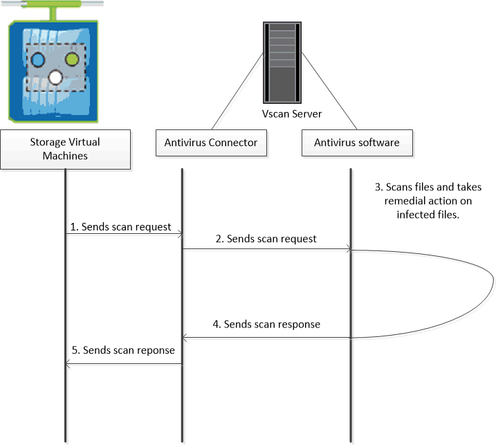

= 关于 NetApp 病毒扫描
:allow-uri-read: 
:icons: font
:imagesdir: ../media/

[role="lead"]
您可以在 NetApp 存储系统上使用集成的防病毒功能，防止数据受到病毒或其他恶意代码的侵害。称为 _Vscan_ 的 NetApp 病毒扫描将同类最佳的第三方防病毒软件与 ONTAP 功能相结合，让您可以灵活地控制扫描哪些文件以及何时扫描。

== 病毒扫描的工作原理

存储系统将扫描操作卸载到托管第三方供应商提供的防病毒软件的外部服务器。ONTAP 防病毒连接器由 NetApp 提供并安装在外部服务器上，用于处理存储系统与防病毒软件之间的通信。

* 当客户端通过 SMB 打开，读取，重命名或关闭文件时，您可以使用 _on-access scanning-来 检查病毒。文件操作将暂停，直到外部服务器报告文件的扫描状态为止。如果文件已扫描，则 ONTAP 允许执行文件操作。否则，它将从服务器请求扫描。
+
NFS 不支持实时扫描。

* 您可以使用 _on-Demand scanning-立即 或按计划检查文件中的病毒。例如，您可能只想在非高峰时段运行扫描。外部服务器会更新已检查文件的扫描状态，以便下次通过 SMB 访问这些文件时，通常会缩短这些文件的文件访问延迟（假设这些文件尚未修改）。
+
您可以对 SVM 命名空间中的任何路径使用按需扫描，即使是仅通过 NFS 导出的卷也是如此。

通常，您可以在 SVM 上同时启用这两种扫描模式。在任一模式下，防病毒软件都会根据软件中的设置对受感染的文件采取补救措施。

