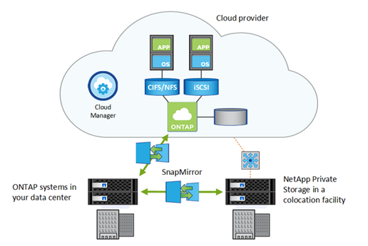

= 数据复制
:allow-uri-read: 
:icons: font
:imagesdir: ../media/

[role="lead"]
SnapMirror 技术可使用 ONTAP Snapshot 副本在内部和云安装之间保持数据同步。SnapMirror 执行块级增量数据传输，以确保仅将更改的数据发送到目标副本。

同样，您也可以使用 SnapMirror 存储关系为在 Cloud Volumes ONTAP 系统上创建的本地 Snapshot 副本创建数据归档。

NetApp Cloud Backup 提供无缝且经济高效的备份和还原功能，用于保护数据并将其归档到云中的对象存储。Cloud Backup 既可用于基于云的数据，也可用于内部数据。

.相关信息
https://["使用 Cloud Volumes ONTAP 在云中设置灾难恢复"]

https://["使用 Cloud Volumes ONTAP 和 SnapMirror 进行高效数据复制"]

link:../data-protection/index.html["使用命令行界面保护 ONTAP 数据"]

https://["NetApp Cloud Backup"]
