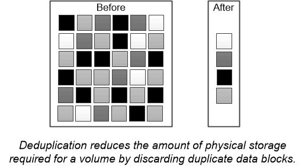

= 重复数据删除
:icons: font
:imagesdir: ../media/

[role="lead"]
_ded重复 数据删除 _ 通过丢弃重复块并将其替换为对单个共享块的引用，减少卷（或 AFF 聚合中的所有卷）所需的物理存储量。读取经过重复数据删除的数据通常不会对性能产生任何影响。除了过载的节点之外，写入所产生的费用可以忽略不计。

由于数据是在正常使用期间写入的，因此 WAFL 会使用批处理过程创建 _block signatures 目录。 _ 开始重复数据删除后， ONTAP 会比较目录中的签名以识别重复块。如果存在匹配项，则会逐个字节进行比较，以验证候选块自创建目录以来是否未发生更改。只有当所有字节匹配时，才会丢弃重复块并回收其磁盘空间。

