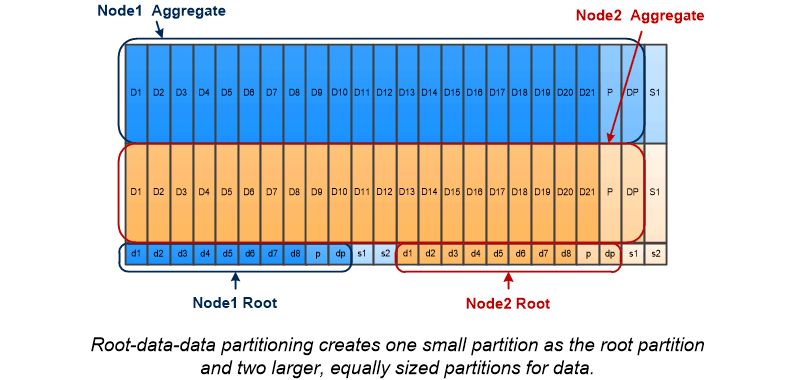

= 根数据分区
:allow-uri-read: 
:icons: font
:imagesdir: ../media/

[role="lead"]
每个节点都必须具有存储系统配置文件的根聚合。根聚合具有数据聚合的 RAID 类型

System Manager 不支持根 - 数据或根 - 数据 - 数据分区。

RAID-DP 类型的根聚合通常由一个数据磁盘和两个奇偶校验磁盘组成。如果系统已为聚合中的每个 RAID 组预留两个磁盘作为奇偶校验磁盘，则要为存储系统文件支付 "`奇偶校验税` " 是一项重大的费用。

根 - 数据分区 _ 通过在磁盘分区之间分配根聚合，在每个磁盘上保留一个小分区作为根分区，并为数据保留一个大分区来减少奇偶校验费用。

image::../media/root-data.gif[根数据]

如图所示，用于存储根聚合的磁盘越多，根分区越小。这种情况也适用于一种名为 _root-data-data partition_ 的根 - 数据分区形式，它会创建一个小分区作为根分区，并为数据创建两个大小相等的较大分区。

这两种类型的根数据分区均属于 ONTAP 高级驱动器分区（ ADP ） _ 功能的一部分。这两种配置在出厂时均已配置：入门级 FAS2xxx ， FAS9000 ， FAS8200 ， FAS80xx 和 AFF 系统的根数据分区，仅适用于 AFF 系统的根数据数据分区。
