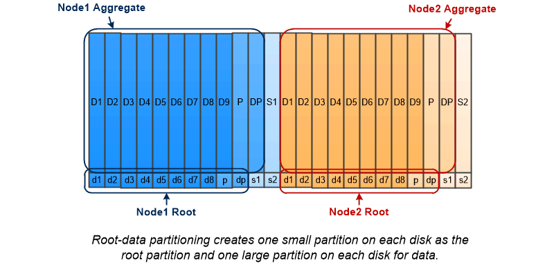

= 根数据分区
:allow-uri-read: 
:icons: font
:imagesdir: ../media/

[role="lead"]
每个节点都必须具有存储系统配置文件的根聚合。根聚合具有数据聚合的 RAID 类型

System Manager 不支持根 - 数据或根 - 数据 - 数据分区。

RAID-DP 类型的根聚合通常由一个数据磁盘和两个奇偶校验磁盘组成。如果系统已为聚合中的每个 RAID 组预留两个磁盘作为奇偶校验磁盘，则要为存储系统文件支付 "`奇偶校验税` " 是一项重大的费用。

根 - 数据分区 _ 通过在磁盘分区之间分配根聚合，在每个磁盘上保留一个小分区作为根分区，并为数据保留一个大分区来减少奇偶校验费用。

如图所示，用于存储根聚合的磁盘越多，根分区越小。这种情况也适用于一种名为 _root-data-data partition_ 的根 - 数据分区形式，它会创建一个小分区作为根分区，并为数据创建两个大小相等的较大分区。

image::../media/root-data-data.gif[根数据数据]

这两种类型的根数据分区均属于 ONTAP 高级驱动器分区（ ADP ） _ 功能的一部分。这两种配置在出厂时均已配置：入门级 FAS2xxx ， FAS9000 ， FAS8200 ， FAS80xx 和 AFF 系统的根数据分区，仅适用于 AFF 系统的根数据数据分区。

了解更多信息 link:https://kb.netapp.com/Advice_and_Troubleshooting/Data_Storage_Software/ONTAP_OS/What_are_the_rules_for_Advanced_Disk_Partitioning["高级驱动器分区"^]。

== 驱动器已分区并用于根聚合

已分区以在根聚合中使用的驱动器取决于系统配置。了解用于根聚合的驱动器数量有助于确定为根分区预留的驱动器容量以及可用于数据聚合的容量。

入门级平台、全闪存FAS 平台以及仅连接SSD的FAS 平台均支持根数据分区功能。

对于入门级平台、仅对内部驱动器进行分区。

对于纯闪存FAS 平台和仅连接SSD的FAS 平台、系统初始化时连接到控制器的所有驱动器都会进行分区、每个节点最多可分区24个驱动器。在系统配置后添加的驱动器不会进行分区。
