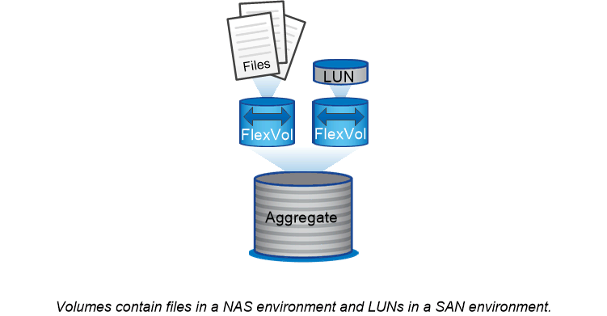

= 卷， qtree ，文件和 LUN
:allow-uri-read: 
:icons: font
:imagesdir: ../media/

[role="lead"]
ONTAP 从名为 _Volume FlexVol 的逻辑容器向客户端和主机提供数据。 _ 由于这些卷只是与其包含的聚合松散耦合，因此与传统卷相比，它们在管理数据方面提供了更大的灵活性。

您可以将多个 FlexVol 卷分配给一个聚合，每个卷专用于不同的应用程序或服务。您可以扩展和缩减 FlexVol 卷，移动 FlexVol 卷以及为 FlexVol 卷创建高效副本。您可以使用 _qtree_ 将 FlexVol 卷分区为更易于管理的单元，并使用 _quotas_ 限制卷资源使用量。

卷包含 NAS 环境中的文件系统和 SAN 环境中的 LUN 。LUN （逻辑单元号）是一个由 SAN 协议寻址的名为 _logical unit_ 的设备的标识符。

LUN 是 SAN 配置中的基本存储单元。Windows 主机将存储系统上的 LUN 视为虚拟磁盘。您可以根据需要无中断地将 LUN 移动到不同的卷。

除了数据卷之外，您还需要了解一些特殊卷：

* 节点根卷 _ （通常为 "`vol0` " ）包含节点配置信息和日志。
* SVM 根卷 _ 充当 SVM 提供的命名空间的入口点，并包含命名空间目录信息。
* 系统卷 _ 包含特殊元数据，例如服务审核日志。

您不能使用这些卷来存储数据。

|===

 a| 
* ； FlexGroup volumes_*

在某些企业中，单个命名空间可能需要数 PB 的存储，甚至远远超过 FlexVol 卷的 100 TB 容量。

FlexGroup 卷 _ 包含 200 个成分卷，支持多达 4000 亿个文件，这些卷协同工作，可以在所有成员之间均匀地动态平衡负载和空间分配。

FlexGroup 卷不需要维护或管理开销。您只需创建 FlexGroup 卷并与 NAS 客户端共享即可。ONTAP 可执行其余操作。

|===