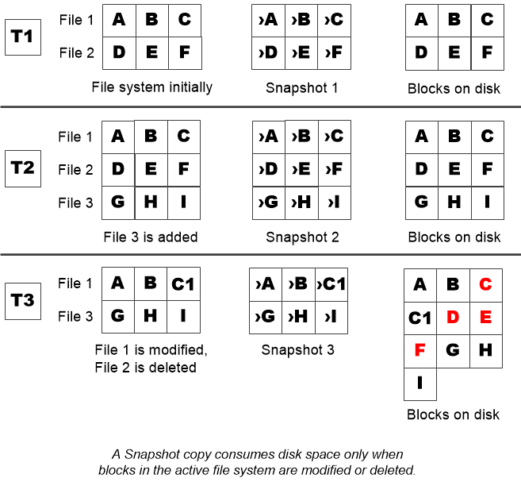

= 何时增加 Snapshot 副本预留
:allow-uri-read: 
:icons: font
:imagesdir: ../media/

[role="lead"]
在决定是否增加 Snapshot 预留时，请务必记住， Snapshot 副本仅会记录自上次创建 Snapshot 副本以来对文件所做的更改。只有在修改或删除活动文件系统中的块时，它才会占用磁盘空间。

这意味着，文件系统的更改率是确定 Snapshot 副本使用的磁盘空间量的关键因素。无论您创建多少 Snapshot 副本，如果活动文件系统未发生更改，它们都不会占用磁盘空间。

例如，包含数据库事务日志的 FlexVol 卷的 Snapshot 副本预留可能高达 20% ，以反映其较高的更改率。您不仅希望创建更多的 Snapshot 副本以捕获更频繁的数据库更新，还希望拥有更大的 Snapshot 副本预留空间以处理 Snapshot 副本占用的额外磁盘空间。

[TIP]
====
Snapshot 副本包含指向块的指针，而不是指向块的副本。您可以将指针视为某个块上的 "`claim` " ： ONTAP "`holds` " 该块，直到删除 Snapshot 副本为止。

====

