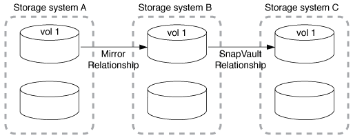

= 扇出和级联数据保护部署
:allow-uri-read: 
:icons: font
:imagesdir: ../media/

[role="lead"]
您可以使用 _fan-out 部署将数据保护扩展到多个二级系统。您可以使用 _c连带 _ 部署将数据保护扩展到三级系统。

扇出和级联部署均支持 SnapMirror 灾难恢复， SnapVault 或统一复制的任意组合；但是， SnapMirror 同步关系（从 ONTAP 9.5 开始受支持）仅支持具有一个或多个异步 SnapMirror 关系的扇出部署，不支持级联部署。扇出配置中只能有一个关系是 SnapMirror 同步关系，源卷中的所有其他关系都必须是异步 SnapMirror 关系。 xref:../smbc/resume-protection-fan-out-configuration.html[SnapMirror 业务连续性] （从 ONTAP 9.8 开始受支持）也支持扇出配置。

[NOTE]
====
您可以使用 _fan-in-_ 部署在多个主系统和一个二级系统之间创建数据保护关系。每个关系都必须在二级系统上使用不同的卷。

====
[NOTE]
====
请注意、属于扇出或级联配置的卷可能需要更长时间才能完成
重新同步。经常会看到SnapMirror关系报告
长时间内的状态"正在准备"。

====

== 扇出部署的工作原理

SnapMirror 支持 _m倍数 镜像 _ 和 _mirror-vaults_ 扇出部署。

多镜像扇出部署由一个源卷组成，该源卷与多个二级卷具有镜像关系。

image::../media/sm-mirror-mirror-fanout.png[数据保护部署：多镜像镜像扇出]

镜像 - 存储扇出部署由一个源卷组成，该源卷与一个二级卷具有镜像关系，并与另一个二级卷具有 SnapVault 关系。

image::../media/sm-mirror-vault-fanout.png[数据保护部署：镜像 - 存储扇出]

从 ONTAP 9.5 开始，您可以使用 SnapMirror 同步关系进行扇出部署；但是，扇出配置中只能有一个关系是 SnapMirror 同步关系，源卷中的所有其他关系都必须是异步 SnapMirror 关系。

image::../media/ssm-fanout.gif[SSM 扇出]

== 级联部署的工作原理

SnapMirror 支持 _mirror-mirror_ ， _mirror-vaults_ ， _vault-mirror_ 和 _vault-vaults_ 级联部署。

镜像 - 镜像级联部署由一系列关系组成，其中，源卷镜像到二级卷，而二级卷镜像到三级卷。如果二级卷不可用，您可以同步主卷和三级卷之间的关系，而无需执行新的基线传输。

从 ONTAP 9.6 开始，在镜像 - 镜像级联部署中支持 SnapMirror 同步关系。只有主卷和二级卷才能处于 SnapMirror 同步关系中。二级卷和三级卷之间的关系必须是异步的。

image::../media/sm-mirror-mirror-cascade.png[SnapMirror 部署：源到镜像 - 镜像级联链]

镜像 - 存储级联部署由一系列关系组成，其中，源卷镜像到二级卷，二级卷存储到三级卷。

此外，还支持存储镜像以及从 ONTAP 9.2 开始的存储 - 存储级联部署：

* 存储 - 镜像级联部署由一系列关系组成，其中，源卷存储到二级卷，而二级卷镜像到三级卷。
* （从 ONTAP 9.2 开始）存储 - 存储级联部署由一系列关系组成，其中，源卷存储到二级卷，二级卷存储到三级卷。

.进一步阅读
* xref:../smbc/resume-protection-fan-out-configuration.html[使用 SM-BC 在扇出配置中恢复保护 ]

