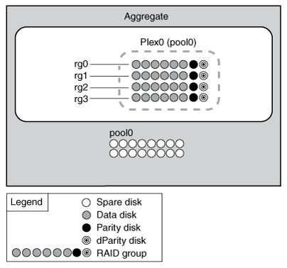

= 未镜像聚合的工作原理
:allow-uri-read: 
:icons: font
:imagesdir: ../media/

[role="lead"]
除非您使用的是 SyncMirror ，否则所有聚合都会取消镜像。未镜像聚合只有一个 _plex_ （其数据的副本），其中包含属于该聚合的所有 RAID 组。

下图显示了一个由磁盘组成的未镜像聚合及其一个丛。聚合包含四个 RAID 组： rg0 ， rg1 ， rg2 和 rg3 。每个 RAID 组都有 6 个数据磁盘，一个奇偶校验磁盘和一个双奇偶校验磁盘。聚合使用的所有磁盘都来自同一个池 pool0 。

下图显示了一个包含阵列 LUN 的未镜像聚合及其一个丛。它具有两个 RAID 组： rg0 和 rg1 。聚合使用的所有阵列 LUN 都来自同一个池 pool0 。

image::../media/unmirrored-aggregate-with-array-luns.gif[上述文本已对该图进行了说明。]
