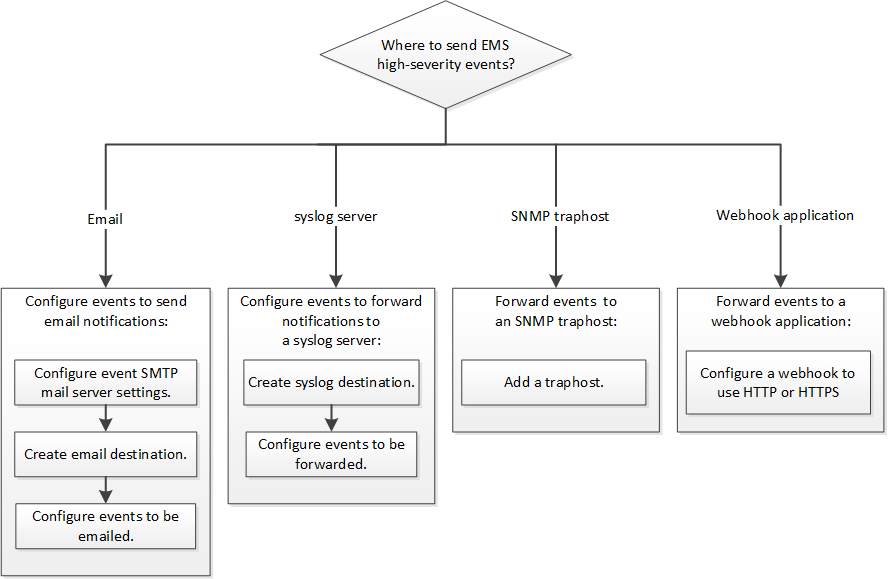

= EMS 配置工作流
:allow-uri-read: 
:icons: font
:imagesdir: ../media/

[role="lead"]
您必须将重要的EMS事件通知配置为以电子邮件形式发送、转发到系统日志服务器、转发到SNMP陷阱主机或转发到webhook应用程序。这有助于您及时采取更正操作，避免系统中断。

如果您的环境已包含用于聚合其他系统（例如服务器和应用程序）中记录的事件的系统日志服务器，则使用该系统日志服务器也可以更方便地从存储系统发出重要事件通知。

如果您的环境尚未包含系统日志服务器，则使用电子邮件发送重要事件通知会更方便。

如果您已将事件通知转发到 SNMP 陷阱主机，则可能需要监控该陷阱主机以查看重要事件。

.选项
* 设置 EMS 以发送事件通知。
+
|===

| 如果您希望 ... | 请参见 ... 

 a| 
用于向电子邮件地址发送重要事件通知的 EMS
 a| 
xref:configure-ems-events-send-email-task.adoc[配置重要的 EMS 事件以发送电子邮件通知]

 a| 
用于将重要事件通知转发到系统日志服务器的 EMS
 a| 
xref:configure-ems-events-notifications-syslog-task.adoc[配置重要的 EMS 事件以将通知转发到系统日志服务器]

 a| 
希望 EMS 将事件通知转发到 SNMP 陷阱主机
 a| 
xref:configure-snmp-traphosts-event-notifications-task.adoc[配置 SNMP 陷阱主机以接收事件通知]

 a| 
希望EMS将事件通知转发到webhook应用程序
 a| 
xref:configure-webhooks-event-notifications-task.adoc[配置重要的EMS事件以将通知转发到webhook应用程序]

|===

