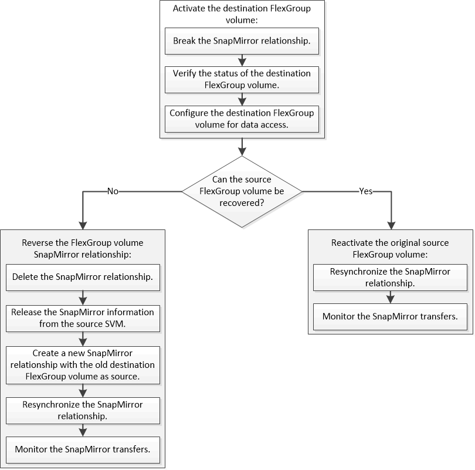

= FlexGroup 卷的灾难恢复工作流
:allow-uri-read: 
:icons: font
:imagesdir: ../media/

[role="lead"]
当源 FlexGroup 卷发生灾难时，您应激活目标 FlexGroup 卷并重定向客户端访问。根据源 FlexGroup 卷是否可以恢复，您应重新激活源 FlexGroup 卷或反转 SnapMirror 关系。

.关于此任务
当某些 SnapMirror 操作（例如 SnapMirror 中断和重新同步）正在运行时，客户端对目标 FlexGroup 卷的访问会暂时被阻止。如果 SnapMirror 操作失败，则某些成分卷可能仍处于此状态，并且对 FlexGroup 卷的访问被拒绝。在这种情况下，您必须重试 SnapMirror 操作。
