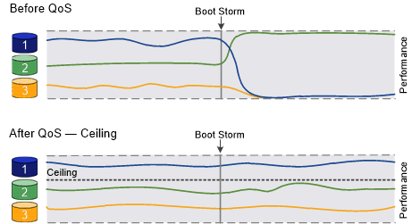
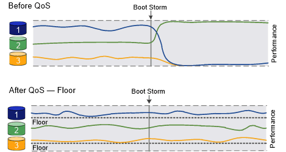

= QoS 概述保证吞吐量
:icons: font
:imagesdir: ../media/

[role="lead"]
您可以使用存储服务质量（ QoS ）来保证关键工作负载的性能不会因争用资源的工作负载而降级。您可以为争用资源的工作负载设置吞吐量上限，以限制其对系统资源的影响，也可以为关键工作负载设置吞吐量上限，以确保满足最小吞吐量目标，而不管争用资源的工作负载有何需求。您甚至可以为同一工作负载设置上限和下限。

== 关于吞吐量上限（ QoS 最大值）

吞吐量上限会将工作负载的吞吐量限制为最大 IOPS 或 MBps 数，或者 IOPS 和 MBps 数。在下图中，工作负载 2 的吞吐量上限可确保它不会 " 抢占 " 工作负载 1 和 3 。

策略组定义了一个或多个工作负载的吞吐量上限。工作负载表示 _storage 对象： _ 卷，文件， qtree 或 LUN ，或者 SVM 中的所有卷，文件， qtree 或 LUN 的 I/O 操作。您可以在创建策略组时指定上限，也可以等到监控工作负载之后再指定上限。

[NOTE]
====
工作负载的吞吐量可能会超出指定上限 10% ，尤其是在工作负载的吞吐量发生快速变化时。要处理突发事件，上限可能会超过 50% 。令牌累积率高达 150% 时，单个节点上发生突发

====

== 关于吞吐量下限（ QoS 最小值）

吞吐量下限可确保工作负载的吞吐量不低于最小 IOPS 或 MBps 或 IOPS 和 MBps 数。在下图中，工作负载 1 和工作负载 3 的吞吐量下限可确保满足最小吞吐量目标，而不管工作负载 2 的需求如何。

[TIP]
====
如示例所示，吞吐量上限会直接限制吞吐量。吞吐量下限会优先考虑设置了下限的工作负载，从而间接限制吞吐量。

====
定义吞吐量下限的策略组不能应用于 SVM 。您可以在创建策略组时指定下限，也可以等到监控工作负载之后再指定下限。

[NOTE]
====
在 ONTAP 9.7 之前的版本中，如果有足够的可用性能容量，则可以保证吞吐量下限。在 ONTAP 9.7 及更高版本中，即使可用性能容量不足，也可以保证吞吐量下限。这种新的楼层行为称为 Floor v2 。为了满足保证要求，对于没有吞吐量下限的工作负载或超出下限设置的工作负载， Floor v2 可能会导致延迟更高。第 2 层适用场景 QoS 和自适应 QoS 。在 ONTAP 9.7P6 及更高版本中，可以选择启用 / 禁用楼层 v2 的新行为。在执行 `volume move trigger-cutover` 等关键操作期间，工作负载可能会低于指定的楼层。即使有足够的可用容量且未执行关键操作，工作负载的吞吐量也可能会低于指定下限 5% 。如果楼层配置过度，并且没有性能容量，则某些工作负载可能会低于指定的楼层。

====

== 关于共享和非共享 QoS 策略组

从 ONTAP 9.4 开始，您可以使用 _non-shared_ QoS 策略组分别指定每个成员工作负载的已定义吞吐量上限或下限适用场景。_shared_ 策略组的行为取决于策略类型：

* 对于吞吐量上限，分配给共享策略组的工作负载的总吞吐量不能超过指定的上限。
* 对于吞吐量下限，共享策略组只能应用于单个工作负载。

== 关于自适应 QoS

通常，分配给存储对象的策略组值是固定的。当存储对象的大小发生变化时，您需要手动更改此值。例如，增加卷上的已用空间量通常需要相应地增加为卷指定的吞吐量上限。

_Adaptive QoS_ 会自动将策略组值扩展到工作负载大小，并在工作负载大小发生变化时保持 IOPS 与 TBSGB 的比率。如果您要在大型部署中管理数百或数千个工作负载，则这是一项显著优势。

通常，您可以使用自适应 QoS 来调整吞吐量上限，但也可以使用它来管理吞吐量下限（当工作负载大小增加时）。工作负载大小表示为存储对象分配的空间或存储对象使用的空间。

[NOTE]
====
在 ONTAP 9.5 及更高版本中，已用空间可用于吞吐量下限。在 ONTAP 9.4 及更早版本中，吞吐量下限不支持此功能。

====
* 已分配空间策略会根据存储对象的标称大小保持 IOPS/TBGB 比率。如果此比率为 100 IOPS/GB ，则只要 150 GB 卷保持此大小，其吞吐量上限将为 15 ， 000 IOPS 。如果将卷大小调整为 300 GB ，则自适应 QoS 会将吞吐量上限调整为 30 ， 000 IOPS 。
* 已用空间策略（默认值）会根据存储效率之前存储的实际数据量保持 IOPS/TBGB 比率。如果此比率为 100 IOPS/GB ，则存储了 100 GB 数据的 150 GB 卷的吞吐量上限为 10 ， 000 IOPS 。随着已用空间量的变化，自适应 QoS 会根据比率调整吞吐量上限。

从 ONTAP 9.5 开始，您可以为应用程序指定 I/O 块大小，以便以 IOPS 和 MBps 为单位表示吞吐量限制。MBps 限制是通过块大小乘以 IOPS 限制计算得出的。例如，如果 I/O 块大小为 32 K ，而 IOPS 限制为 6144IOPS/TB ，则 MBps 限制为 192 MBps 。

吞吐量上限和下限均会出现以下行为：

* 将工作负载分配给自适应 QoS 策略组后，上限或下限将立即更新。
* 调整自适应 QoS 策略组中的工作负载大小后，上限或下限大约会在五分钟内更新。

在进行更新之前，吞吐量必须至少增加 10 IOPS 。

自适应 QoS 策略组始终为非共享组：定义的吞吐量上限或每个成员工作负载的下限适用场景。

从 ONTAP 9.6 开始，采用 SSD 的 ONTAP Select Premium 支持吞吐量下限。

== 常规支持

下表显示了在支持吞吐量上限，吞吐量下限和自适应 QoS 方面的差异。

|===
| 资源或功能 | 吞吐量上限 | 吞吐量下限 | 吞吐量下限 v2 | 自适应 QoS 

 a| 
ONTAP 9 版本
 a| 
全部
 a| 
9.2 及更高版本
 a| 
9.7 及更高版本
 a| 
9.3 及更高版本

 a| 
平台
 a| 
全部
 a| 
* AFF
* C190 *
* 采用 SSD * 的 ONTAP Select 高级版

 a| 
* AFF
* C190
* 采用 SSD 的 ONTAP Select 高级版

 a| 
全部

 a| 
协议
 a| 
全部
 a| 
全部
 a| 
全部
 a| 
全部

 a| 
FabricPool
 a| 
是的。
 a| 
是，如果分层策略设置为 " 无 " 且云中没有块。
 a| 
是，如果分层策略设置为 " 无 " 且云中没有块。
 a| 
是的。

 a| 
SnapMirror 同步
 a| 
是的。
 a| 
否
 a| 
否
 a| 
是的。

|===
ONTAP Select 9.6 版开始支持 * 。 c190 和 ONTAP 。

== 支持的工作负载达到吞吐量上限

下表按 ONTAP 9 版本显示了工作负载对吞吐量上限的支持。不支持根卷，负载共享镜像和数据保护镜像。

|===
| 工作负载支持—上限 | 9.0 | 9.1 | 9.2 | 9.3 | 9.4 及更高版本 | 9.8 及更高版本 

 a| 
Volume
 a| 
是的。
 a| 
是的。
 a| 
是的。
 a| 
是的。
 a| 
是的。
 a| 
是的。

 a| 
文件
 a| 
是的。
 a| 
是的。
 a| 
是的。
 a| 
是的。
 a| 
是的。
 a| 
是的。

 a| 
LUN
 a| 
是的。
 a| 
是的。
 a| 
是的。
 a| 
是的。
 a| 
是的。
 a| 
是的。

 a| 
SVM
 a| 
是的。
 a| 
是的。
 a| 
是的。
 a| 
是的。
 a| 
是的。
 a| 
是的。

 a| 
FlexGroup 卷
 a| 
否
 a| 
否
 a| 
否
 a| 
是的。
 a| 
是的。
 a| 
是的。

 a| 
qtree*
 a| 
否
 a| 
否
 a| 
否
 a| 
否
 a| 
否
 a| 
是的。

 a| 
每个策略组具有多个工作负载
 a| 
是的。
 a| 
是的。
 a| 
是的。
 a| 
是的。
 a| 
是的。
 a| 
是的。

 a| 
非共享策略组
 a| 
否
 a| 
否
 a| 
否
 a| 
否
 a| 
是的。
 a| 
是的。

|===
* 从 ONTAP 9.8 开始，在启用了 NFS 的 FlexVol 和 FlexGroup 卷的 qtree 中支持 NFS 访问。从 ONTAP 9.1.1 开始，在启用了 SMB 的 FlexVol 和 FlexGroup 卷的 qtree 中也支持 SMB 访问。

== 支持吞吐量下限的工作负载

下表按 ONTAP 9 版本显示了吞吐量下限的工作负载支持。不支持根卷，负载共享镜像和数据保护镜像。

|===
| 工作负载支持—楼层 | 9.2 | 9.3 | 9.4 及更高版本 | 9.8 及更高版本 

 a| 
Volume
 a| 
是的。
 a| 
是的。
 a| 
是的。
 a| 
是的。

 a| 
文件
 a| 
否
 a| 
是的。
 a| 
是的。
 a| 
是的。

 a| 
LUN
 a| 
是的。
 a| 
是的。
 a| 
是的。
 a| 
是的。

 a| 
SVM
 a| 
否
 a| 
否
 a| 
否
 a| 
是的。

 a| 
FlexGroup 卷
 a| 
否
 a| 
否
 a| 
是的。
 a| 
是的。

 a| 
qtree *
 a| 
否
 a| 
否
 a| 
否
 a| 
是的。

 a| 
每个策略组具有多个工作负载
 a| 
否
 a| 
否
 a| 
是的。
 a| 
是的。

 a| 
非共享策略组
 a| 
否
 a| 
否
 a| 
是的。
 a| 
是的。

|===
* 从 ONTAP 9.8 开始，在启用了 NFS 的 FlexVol 和 FlexGroup 卷的 qtree 中支持 NFS 访问。从 ONTAP 9.1.1 开始，在启用了 SMB 的 FlexVol 和 FlexGroup 卷的 qtree 中也支持 SMB 访问。

== 自适应 QoS 支持的工作负载

下表显示了 ONTAP 9 版本对自适应 QoS 的工作负载支持。不支持根卷，负载共享镜像和数据保护镜像。

|===
| 工作负载支持—自适应 QoS | 9.3 | 9.4 及更高版本 

 a| 
Volume
 a| 
是的。
 a| 
是的。

 a| 
文件
 a| 
否
 a| 
是的。

 a| 
LUN
 a| 
否
 a| 
是的。

 a| 
SVM
 a| 
否
 a| 
否

 a| 
FlexGroup 卷
 a| 
否
 a| 
是的。

 a| 
每个策略组具有多个工作负载
 a| 
是的。
 a| 
是的。

 a| 
非共享策略组
 a| 
是的。
 a| 
是的。

|===

== 工作负载和策略组的最大数量

下表按 ONTAP 9 版本显示了工作负载和策略组的最大数量。

|===
| 工作负载支持 | 9.3 及更早版本 | 9.4 及更高版本 

 a| 
每个集群的最大工作负载数
 a| 
12,000
 a| 
40,000

 a| 
每个节点的最大工作负载数
 a| 
12,000
 a| 
40,000

 a| 
最大策略组数
 a| 
12,000
 a| 
12,000

|===