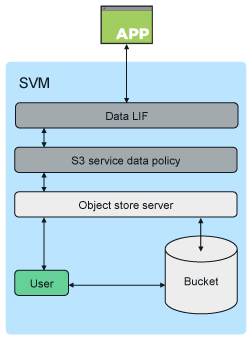

= ONTAP S3 架构和用例
:allow-uri-read: 
:icons: font
:imagesdir: ../media/

[role="lead"]
在 ONTAP 中，存储分段的底层架构是 FlexGroup 卷—一个命名空间，由多个成分卷组成，但作为一个卷进行管理。

image::../media/fg-overview-s3-config.gif[FlexGroup 卷表示为一组称为成分卷的 FlexVol 卷]

存储分段仅受底层硬件的物理上限限制，架构上限可能更高。存储分段可以利用 FlexGroup 弹性大小调整功能，在 FlexGroup 卷的成分卷空间即将用尽时自动增加该成分卷的大小。每个 FlexGroup 卷的存储分段数不得超过 1000 个，或者限制为 FlexGroup 卷容量的 1/3 （以考虑存储分段中的数据增长）。

[NOTE]
====
不允许对包含 S3 分段的 FlexGroup 卷进行 NAS 或 SAN 协议访问。

====
您可以通过授权用户和客户端应用程序访问存储分段。

客户端访问 ONTAP S3 服务的主要用例有三种：

* 对于使用 ONTAP S3 作为远程 FabricPool 容量（云）层的 ONTAP 系统
+
包含容量层（对于 _c冷 _ 数据）的 S3 服务器和存储分段与性能层（对于 _hot_ 数据）位于不同的集群上。

* 对于使用 ONTAP S3 作为本地 FabricPool 层的 ONTAP 系统
+
包含容量层的 S3 服务器和存储分段与性能层位于同一集群上，但位于不同的 HA 对上。

* 外部 S3 客户端应用程序
+
ONTAP S3 为在非 NetApp 系统上运行的 S3 客户端应用程序提供支持。

最好使用 HTTPS 访问 ONTAP S3 存储分段。启用 HTTPS 后，要与 SSL/TLS 正确集成，需要安全证书。然后，需要客户端用户` 的访问权限和机密密钥才能使用 ONTAP S3 对用户进行身份验证，并为用户` 授予在 ONTAP S3 中执行操作的访问权限。客户端应用程序还应有权访问根 CA 证书（ ONTAP S3 服务器的签名证书），以便能够对服务器进行身份验证并在客户端和服务器之间创建安全连接。

用户在启用了 S3 的 SVM 中创建，其访问权限可以在存储分段或 SVM 级别进行控制，也就是说，可以为其授予对 SVM 中一个或多个存储分段的访问权限。

默认情况下， ONTAP S3 服务器上启用 HTTPS 。可以为客户端访问禁用 HTTPS 并启用 HTTP ，在这种情况下，不需要使用 CA 证书进行身份验证。但是，如果启用了 HTTP 且禁用了 HTTPS ，则与 ONTAP S3 服务器的所有通信都将通过网络以明文形式发送。

对于追加信息，请参见 https://www.netapp.com/pdf.html?item=/media/17219-tr4814pdf.pdf["技术报告： ONTAP 最佳实践中的 S3"]

.相关信息
link:../flexgroup/index.html["FlexGroup 卷管理"]
