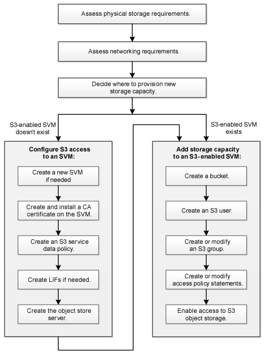

= S3 配置工作流
:allow-uri-read: 
:icons: font
:imagesdir: ../media/

[role="lead"]
配置 S3 包括评估物理存储和网络要求，然后选择特定于您的目标的工作流—配置对新的或现有 SVM 的 S3 访问，或者向已完全配置 S3 访问的现有 SVM 添加存储分段和用户。

在使用System Manager配置对新Storage VM的S3访问时、系统会提示您输入证书和网络信息、并在一次操作中创建Storage VM和S3对象存储服务器。

