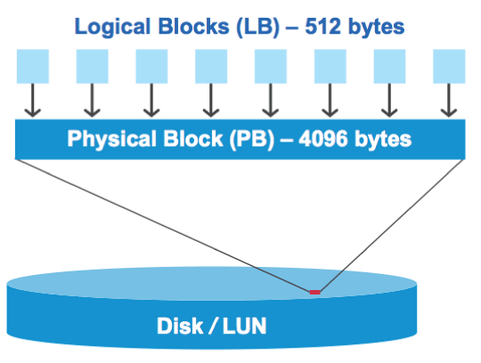

= 正确对齐的 LUN 概述可能会发生 I/O 不对齐
:icons: font
:imagesdir: ../media/

[role="lead"]
ONTAP 可能会报告正确对齐的 LUN 上的 I/O 不对齐。通常，只要您确信 LUN 配置正确且分区表正确无误，就可以忽略这些错位警告。

LUN 和硬盘都以块形式提供存储。由于主机上磁盘的块大小为 512 字节，因此 LUN 会向主机提供此大小的块，而实际使用更大的 4 KB 块来存储数据。主机使用的 512 字节数据块称为逻辑块。LUN 用于存储数据的 4 KB 数据块称为物理块。这意味着每个 4 KB 物理块中有八个 512 字节逻辑块。

主机操作系统可以在任何逻辑块上开始读取或写入 I/O 操作。只有在 I/O 操作从物理块中的第一个逻辑块开始时，才会将其视为对齐。如果 I/O 操作从逻辑块开始，而该逻辑块不是物理块的起点，则会将 I/O 视为错位。ONTAP 会自动检测错位问题，并在 LUN 上报告。但是， I/O 不对齐并不一定意味着 LUN 也不对齐。在正确对齐的 LUN 上，可能会报告未对齐的 I/O 。

如果需要进一步调查，技术支持可以运行诊断命令来显示详细的 I/O 对齐数据，以确认是否存在真正的 LUN 不对齐。

有关用于更正对齐问题的工具的详细信息，请参见以下文档： +

* https://docs.netapp.com/us-en/ontap-sanhost/hu_wuhu_71.html["Windows Unified Host Utilities 7.1"]
* https://docs.netapp.com/ontap-9/topic/com.netapp.doc.exp-iscsi-esx-cpg/GUID-7428BD24-A5B4-458D-BD93-2F3ACD72CBBB.html["《适用于 VMware vSphere 的 Virtual Storage Console 安装和管理指南》"]

* 相关信息 *

https://kb.netapp.com/Advice_and_Troubleshooting/Data_Storage_Software/Virtual_Storage_Console_for_VMware_vSphere/Guest_VM_file_system_partition%2F%2Fdisk_alignment_for_VMware_vSphere["适用于 VMware vSphere ，其他虚拟环境和 NetApp 存储系统的子虚拟机文件系统分区 / 磁盘对齐"]
