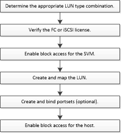

= LUN 设置工作流
:icons: font
:imagesdir: ../media/

== 在 ONTAP 中执行此操作的其他方法

[cols="2*"]
|===
| * 要使用 ... 完成此任务，请执行以下操作： * | * 请参见此内容 ...* 

| 重新设计的 System Manager （在 9.7 及更高版本中提供）  a| 
* https://docs.netapp.com/us-en/ontap/task_san_provision_vmware.html["为 VMware 数据存储库配置 SAN 存储"]
* https://docs.netapp.com/us-en/ontap/task_san_provision_linux.html["为 Linux 服务器配置 SAN 存储"]
* https://docs.netapp.com/us-en/ontap/task_san_provision_windows.html["为 Windows 服务器配置 SAN 存储"]

| System Manager 经典版（ 9.7 及更早版本提供）  a| 
* https://docs.netapp.com/us-en/ontap-sm-classic/fc-config-esxi/concept_fc_configuration_workflow.html["使用 VSC 为 ESXi 配置 FC"]
* https://docs.netapp.com/us-en/ontap-sm-classic/fc-config-rhel/concept_fc_configuration_workflow.html["适用于 Red Hat Enterprise Linux 的 FC 配置"]
* https://docs.netapp.com/us-en/ontap-sm-classic/fc-config-windows/concept_fc_configuration_workflow.html["适用于 Windows 的 FC 配置"]
* https://docs.netapp.com/us-en/ontap-sm-classic/iscsi-config-esxi/concept_iscsi_configuration_provisioning_workflow.html["使用 VSC 为 ESXi 配置 iSCSI"]
* https://docs.netapp.com/us-en/ontap-sm-classic/iscsi-config-rhel/index.html["适用于 Red Hat Enterprise Linux 的 iSCSI 配置"]
* https://docs.netapp.com/us-en/ontap-sm-classic/iscsi-config-windows/concept_iscsi_configuration_workflow.html["适用于 Windows 的 iSCSI 配置"]

|===