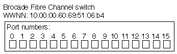

= 使用 FC 进行 SAN 配置
:allow-uri-read: 
:icons: font
:imagesdir: ../media/

[role="lead"]
您应了解了解了解 ONTAP 如何实施 FC SAN 所需的重要概念。

== FC 目标节点如何连接到网络

存储系统和主机具有适配器，因此可以使用缆线将其连接到 FC 交换机。

当节点连接到 FC SAN 时，每个 SVM 都会将其 LIF 的全球通用端口名称（ WWPN ）注册到交换机的 Fabric Name Service 。ONTAP 会自动分配 SVM 的 WWNN 和每个 LIF 的 WWPN 。

[NOTE]
====
不支持从具有 FC 的主机直接连接到节点，需要 NPIV ，这需要使用交换机。对于 iSCSI 会话，通信可以与网络路由或直接连接的连接进行。但是， ONTAP 支持这两种方法。

====

== 如何标识 FC 节点

配置有 FC 的每个 SVM 都通过一个全球通用节点名称（ WWNN ）来标识。

== 如何使用 WWPN

WWPN 用于标识 SVM 中配置为支持 FC 的每个 LIF 。这些 LIF 利用集群中每个节点中的物理 FC 端口，这些端口可以是在节点中配置为 FC 或 FCoE 的 FC 目标卡， UTA 或 UTA2 。

* 创建启动程序组
+
主机 HBA 的 WWPN 用于创建启动程序组（ igroup ）。igroup 用于控制主机对特定 LUN 的访问。您可以通过指定 FC 网络中启动程序的 WWPN 集合来创建 igroup 。将存储系统上的 LUN 映射到 igroup 时，您可以授予该组中的所有启动程序对该 LUN 的访问权限。如果主机的 WWPN 不在映射到 LUN 的 igroup 中，则该主机将无法访问此 LUN 。这意味着 LUN 不会显示为该主机上的磁盘。

+
您还可以创建端口集，使 LUN 仅在特定目标端口上可见。端口集由一组 FC 目标端口组成。您可以将 igroup 绑定到端口集。igroup 中的任何主机只能通过连接到端口集中的目标端口来访问 LUN 。

* 唯一标识 FC LIF
+
WWPN 可唯一标识每个 FC 逻辑接口。主机操作系统将结合使用 WWNN 和 WWPN 来标识 SVM 和 FC LIF 。某些操作系统要求使用永久性绑定，以确保 LUN 显示在主机上的同一目标 ID 上。

== 全球通用名称分配的工作原理

全球通用名称在 ONTAP 中按顺序创建。但是，由于 ONTAP 采用的分配方式，它们可能看起来似乎是按非顺序分配的。

每个适配器都有一个预配置的 WWPN 和 WWNN ，但 ONTAP 不使用这些预配置的值。相反， ONTAP 会根据板载以太网端口的 MAC 地址分配自己的 WWPN 或 WWNN 。

如果分配了全球通用名称，则此名称可能会显示为非顺序名称，原因如下：

* 全球通用名称会分配给集群中的所有节点和 Storage Virtual Machine （ SVM ）。
* 释放的全球通用名称将被回收并添加回可用名称池。

== 如何识别 FC 交换机

光纤通道交换机的设备本身具有一个全球通用节点名称（ WWNN ），其每个端口具有一个全球通用端口名称（ WWPN ）。

例如，下图显示了如何为 16 端口 Brocade 交换机上的每个端口分配 WWPN 。有关特定交换机的端口编号方式的详细信息，请参见供应商为该交换机提供的文档。

端口*0*，WWPN 20:**00**：00:60:69:51:06:b4

端口*1*，WWPN 20:**01**：00:60:69:51:06:b4

端口 * 14 * ， WWPN 20 ： 0e* ： 00 ： 60 ： 69 ： 51 ： 06 ： b4

端口 * 15 * ， WWPN 20 ： * 。 0f* ： 00 ： 60 ： 69 ： 51 ： 06 ： b4
