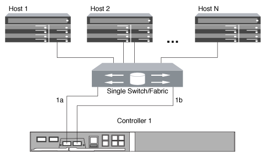

= 使用单个节点配置 FC 和 FC-NVMe SAN 主机的方式
:allow-uri-read: 
:icons: font
:imagesdir: ../media/

[role="lead"]
您可以通过一个或多个网络结构为 FC 和 FC-NVMe SAN 主机配置单个节点。需要 N-Port ID 虚拟化（ NPIV ），并且必须在网络结构中的所有 FC 交换机上启用。如果不使用 FC 交换机，则无法将 FC 或 FC-NMVE SAN 主机直接连接到单个节点。

您可以通过单个网络结构或多个网络结构为 FC 或 FC-NVMe SAN 主机配置单个节点。例如，图中的 FC 目标端口（ 0a ， 0c ， 0b ， 0d ）。实际端口号因存储节点的型号以及是否使用扩展适配器而异。

== 单网络结构单节点配置

在单网络结构单节点配置中，有一个交换机将单个节点连接到一个或多个主机。由于只有一个交换机，因此此配置并非完全冗余。支持 FC 和 FC-NVMe 的所有硬件平台均支持单网络结构单节点配置。但是， FAS2240 平台需要 X1150A-R6 扩展适配器来支持单网络结构单节点配置。

下图显示了 FAS2240 单网络结构单节点配置。它会并排显示存储控制器，这是在 FAS2240-2 中如何挂载这些控制器的。对于 FAS2240-4 ，控制器将在另一个之上挂载。这两种型号的 SAN 配置没有区别。

== 多网络结构单节点配置

在多网络结构单节点配置中，有两个或更多交换机将单个节点连接到一个或多个主机。为了简单起见，下图显示了一个仅包含两个网络结构的多网络结构单节点配置，但在任何多网络结构配置中，您可以有两个或更多网络结构。在此图中，存储控制器挂载在顶部机箱中，底部机箱可以为空，也可以具有 IOMX 模块，如本示例所示。

image::../media/scrn_en_drw_fc-62xx-multi-singlecontroller.png[多网络结构单节点配置示意图]

.相关信息
http://www.netapp.com/us/media/tr-4684.pdf["NetApp 技术报告 4684 ：《使用 NVMe/FC 实施和配置现代 SAN 》"]
