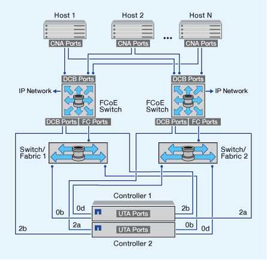

= 配置 FCoE 的方式概述
:allow-uri-read: 
:icons: font
:imagesdir: ../media/

[role="lead"]
可以使用 FCoE 交换机以多种方式配置 FCoE 。FCoE 不支持直连配置。

所有 FCoE 配置均为双网络结构，完全冗余，需要主机端多路径软件。在所有 FCoE 配置中，启动程序和目标之间的路径中可以有多个 FCoE 和 FC 交换机，但最高不超过最大跃点计数限制。要将交换机彼此连接起来，交换机必须运行支持以太网 ISL 的固件版本。任何 FCoE 配置中的每个主机都可以配置不同的操作系统。

FCoE 配置需要明确支持 FCoE 功能的以太网交换机。FCoE 配置通过与 FC 交换机相同的互操作性和质量保证过程进行验证。互操作性表中列出了支持的配置。这些受支持配置中包含的一些参数包括交换机型号，可在单个网络结构中部署的交换机数量以及受支持的交换机固件版本。

例如，图中的 FC 目标扩展适配器端口号。实际端口号可能会有所不同，具体取决于安装 FCoE 目标扩展适配器的扩展插槽。

== FCoE 启动程序到 FC 目标

使用 FCoE 启动程序（ CNA ），您可以通过 FCoE 交换机将主机连接到 HA 对中的两个控制器，并连接到 FC 目标端口。FCoE 交换机还必须具有 FC 端口。主机 FCoE 启动程序始终连接到 FCoE 交换机。FCoE 交换机可以直接连接到 FC 目标，也可以通过 FC 交换机连接到 FC 目标。

下图显示了连接到 FCoE 交换机的主机 CNA ，然后连接到 FC 交换机，再连接到 HA 对：

image::../media/scrn-en-drw-fcoe-dual-2p-targ.gif[SCRN en drw FCoE 双端口 2p Targ]

== FCoE 启动程序到 FCoE 目标

使用主机 FCoE 启动程序（ CNA ），您可以通过 FCoE 交换机将主机连接到 HA 对中的两个控制器，并连接到 FCoE 目标端口（也称为 UTAS 或 UTA2 ）。

image::../media/scrn_en_drw_fcoe-end-to-end.png[SCRN 以端到端的方式使用 FCoE]

== FCoE 启动程序到 FCoE 和 FC 目标

使用主机 FCoE 启动程序（ CNA ），您可以通过 FCoE 交换机将主机连接到 HA 对中的两个控制器，并连接到 FCoE 和 FC 目标端口（也称为 UTAS 或 UTA2 ）。

image::../media/scrn_en_drw_fcoe-mixed.png[SCRN en drw FCoE 混合]

== FCoE 与 IP 存储协议混合使用

使用主机 FCoE 启动程序（ CNA ），您可以通过 FCoE 交换机将主机连接到 HA 对中的两个控制器，并连接到 FCoE 目标端口（也称为 UTAS 或 UTA2 ）。FCoE 端口不能对单个交换机使用传统链路聚合。Cisco 交换机支持支持 FCoE 的特殊类型的链路聚合（虚拟端口通道）。虚拟端口通道可将各个链路聚合到两个交换机。您也可以将虚拟端口通道用于其他以太网流量。用于FCoE以外的流量(包括NFS、SMB、iSCSI和其他以太网流量)的端口可以使用FCoE交换机上的常规以太网端口。

