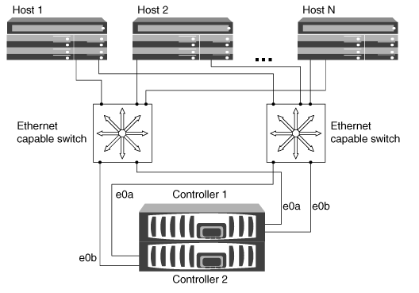

= 为 iSCSI SAN 主机配置 HA 对的方式
:allow-uri-read: 
:icons: font
:imagesdir: ../media/

[role="lead"]
您可以使用一个或多个 IP 交换机将 iSCSI SAN 主机配置为连接到双节点或多节点配置。您应确定所需的单交换机配置不是完全冗余的，还是完全冗余的多交换机配置。

您可以在直连，单网络或多网络环境中为 iSCSI SAN 主机配置单个控制器和 HA 对。HA 对可以与每个交换机建立多个 iSCSI 连接，但每台主机上都需要支持 ALUA 的多路径软件。如果有多个主机，则可以通过检查 NetApp 互操作性表工具为每个主机配置不同的操作系统。

https://["NetApp 互操作性表工具"^]

== 直接连接

在直连配置中，一个或多个主机直接连接到控制器。

image::../media/dual-host-dual-controller.gif[双主机双控制器]

== 单网络 HA 对

在单网络 HA 对配置中，一个交换机将 HA 对连接到一个或多个主机。由于只有一个交换机，因此此配置并非完全冗余。

image::../media/scrn-en-drw-iscsi-single.gif[scrn en drw iscsi single]

== 多网络 HA 对

在多网络 HA 对配置中，两个或更多交换机将 HA 对连接到一个或多个主机。由于有多个交换机，因此此配置完全冗余。

