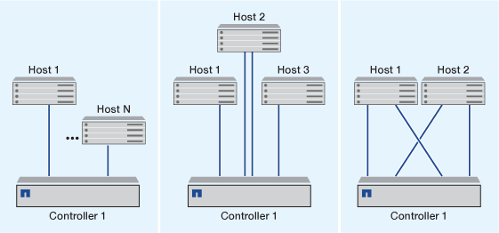

= 为 iSCSI SAN 主机配置单个节点的方式
:allow-uri-read: 
:icons: font
:imagesdir: ../media/

[role="lead"]
您可以将 iSCSI SAN 主机配置为直接连接到单个节点或使用一个或多个 IP 交换机。您应确定所需的单交换机配置不是完全冗余的，还是完全冗余的多交换机配置。

您可以在直连，单交换机或多交换机环境中配置 iSCSI SAN 主机。如果有多个主机连接到节点，则可以为每个主机配置不同的操作系统。对于单网络和多网络配置，节点可以与交换机建立多个 iSCSI 连接，但需要支持 ALUA 的多路径软件。

[NOTE]
====
如果从主机到控制器有多条路径，则必须在主机上启用 ALUA 。

====

== 直连单节点配置

在直连配置中，一个或多个主机直接连接到节点。

== 单网络单节点配置

在单网络单节点配置中，一个交换机将单个节点连接到一个或多个主机。由于只有一个交换机，因此此配置并非完全冗余。

image::../media/r-oc-set-iscsi-singlenetwork-singlenode.gif[设置 iSCSI 单工单节点]

== 多网络单节点配置

在多网络单节点配置中，两个或多个交换机将一个节点连接到一个或多个主机。由于有多个交换机，因此此配置完全冗余。

image::../media/scrn-en-drw-iscsi-multinw-singlen.gif[scrn en drw iscsi multinw singlen]
