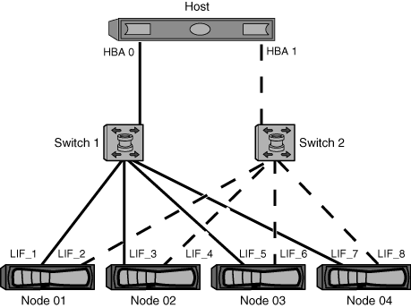

= 双网络结构 HA 对分区
:icons: font
:imagesdir: ../media/

[role="lead"]
在双网络结构配置中，您可以将每个主机启动程序连接到每个集群节点。每个主机启动程序都使用不同的交换机来访问集群节点。要管理多个路径，需要在主机上安装多路径软件。

双网络结构配置被视为高可用性，因为在单个组件发生故障时，仍可访问数据。

在下图中，主机具有两个启动程序，并且正在运行多路径软件。有两个分区。配置 SLM 后，所有节点均视为报告节点。

[NOTE]
====
此图中使用的命名约定只是建议您可以选择对 ONTAP 解决方案使用一种可能的命名约定。

====
* 分区 1 ： HBA 0 ， LIF_1 ， LIF_3 ， LIF_5 和 LIF_7
* 区域 2 ： HBA 1 ， LIF_2 ， LIF_4 ， LIF_6 和 LIF_8

每个主机启动程序都通过不同的交换机进行分区。分区 1 通过交换机 1 进行访问。分区 2 通过交换机 2 进行访问。

每个启动程序都可以访问每个节点上的 LIF 。这样，当节点出现故障时，主机仍可访问其 LUN 。根据选择性 LUN 映射（ SLM ）的设置和报告节点配置， SVM 可以访问集群模式解决方案中每个节点上的所有 iSCSI 和 FC LIF 。您可以使用 SLM ，端口集或 FC 交换机分区来减少从 SVM 到主机的路径数以及从 SVM 到 LUN 的路径数。

如果配置包含更多节点，则这些分区中将包含其他节点的 LIF 。

[NOTE]
====
主机操作系统和多路径软件必须支持用于访问节点上 LUN 的路径数。

====
https://hwu.netapp.com["NetApp Hardware Universe"]
