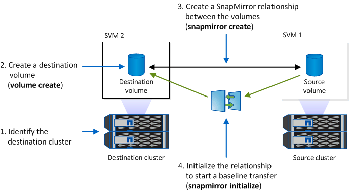

= 镜像WORM文件以进行灾难恢复
:allow-uri-read: 
:icons: font
:imagesdir: ../media/

[role="lead"]
您可以使用 SnapMirror 将 WORM 文件复制到其他地理位置，以实现灾难恢复和其他目的。必须为源卷和目标卷配置 SnapLock ，并且这两个卷都必须具有相同的 SnapLock 模式：合规性或企业。复制卷和文件的所有关键 SnapLock 属性。

.前提条件
必须在具有对等 SVM 的对等集群中创建源卷和目标卷。有关详细信息，请参见 https://docs.netapp.com/us-en/ontap-sm-classic/peering/index.html["集群和 SVM 对等"]。

.关于此任务
* 从 ONTAP 9.5 开始，您可以使用 XDP （扩展数据保护）类型的 SnapMirror 关系复制 WORM 文件，而不是使用 DP （数据保护）类型的关系。XDP 模式与 ONTAP 版本无关，并且能够区分存储在同一块中的文件，从而更容易重新同步复制的 Compliance 模式卷。有关如何将现有 DP 类型关系转换为 XDP 类型关系的信息，请参见 link:../data-protection/index.html["数据保护"]。
* 如果 SnapLock 确定 Compliance 模式卷的 DP 类型 SnapMirror 关系将导致数据丢失，则对该关系执行重新同步操作将失败。如果重新同步操作失败、您可以使用 `volume clone create` 命令创建目标卷的克隆。然后，您可以将源卷与克隆重新同步。
* SnapLock 兼容卷之间的 XDP 类型的 SnapMirror 关系支持在中断后重新同步，即使在中断后目标上的数据与源上的数据发生了差异也是如此。
+
在重新同步时，如果检测到源目标与通用快照之间存在数据差异，则会在目标上创建一个新快照以捕获此差异。新快照和通用快照都将锁定，并保留如下所示的保留时间：

+
** 目标的卷到期时间
** 如果卷到期时间为过去或尚未设置，则快照将锁定 30 天
** 如果目标具有合法保留、则实际卷到期期限会被屏蔽并显示为"`不确定`"；但是、快照会在实际卷到期期限内锁定。

如果目标卷的到期期限晚于源卷，则目标到期期限将保留，并且不会被重新同步后源卷的到期期限所覆盖。

如果目标上放置的合法保留与源不同，则不允许重新同步。在尝试重新同步之前，源和目标必须具有相同的合法保留，或者必须释放目标上的所有合法保留。

可以使用命令行界面运行将为捕获不同数据而创建的目标卷上锁定的Snapshot副本复制到源卷 `snapmirror update -s snapshot` 命令：复制后的快照也将继续在源上锁定。

* 不支持 SVM 数据保护关系。
* 不支持负载共享数据保护关系。

下图显示了用于初始化 SnapMirror 关系的操作步骤：

[role="tabbed-block"]
====
.System Manager
--
从ONTAP 9.12.1开始、您可以使用System Manager设置WORM文件的SnapMirror复制。

.步骤
. 导航到*存储>卷*。
. 单击*显示/隐藏*并选择* SnapLock 类型*以在*卷*窗口中显示此列。
. 找到SnapLock 卷。
. 单击 image:icon_kabob.gif["菜单选项"] 并选择*保护*。
. 选择目标集群和目标Storage VM。
. 单击 * 更多选项 * 。
. 选择*显示原有策略*、然后选择*默认(原有)*。
. 在*目标配置详细信息*部分中、选择*覆盖传输计划*并选择*每小时*。
. 单击 * 保存 * 。
. 在源卷名称的左侧、单击箭头展开卷详细信息、然后在页面右侧查看远程SnapMirror保护详细信息。
. 在远程集群上、导航到*保护关系*。
. 找到关系并单击目标卷名称以查看关系详细信息。
. 验证目标卷的SnapLock 类型和其他SnapLock 信息。

--
.命令行界面
--
. 确定目标集群。
. 在目标集群上、 link:https://docs.netapp.com/us-en/ontap/system-admin/install-license-task.html["安装SnapLock许可证"]， link:https://docs.netapp.com/us-en/ontap/snaplock/initialize-complianceclock-task.html["初始化Compliance时钟"]如果您使用的是9.10.1之前的ONTAP版本， link:https://docs.netapp.com/us-en/ontap/snaplock/create-snaplock-aggregate-task.html["创建SnapLock聚合"]。
. 在目标集群上、创建类型为的SnapLock目标卷 `DP` 大小等于或大于源卷：
+
`*volume create -vserver _SVM_name_ -volume _volume_name_ -aggregate _aggregate_name_ -snaplock-type compliance|enterprise -type DP -size _size_*`

+

NOTE: 从 ONTAP 9.10.1 开始， SnapLock 卷和非 SnapLock 卷可以位于同一聚合上；因此，如果使用的是 ONTAP 9.10.1 ，则不再需要创建单独的 SnapLock 聚合。您可以使用volume -SnapLock-type选项指定Compliance或Enterprise SnapLock 卷类型。在ONTAP 9.10.1之前的ONTAP 版本中、SnapLock 模式-合规性或企业-是从聚合继承的。不支持版本灵活的目标卷。目标卷的语言设置必须与源卷的语言设置匹配。

+
以下命令将创建一个2 GB的SnapLock `Compliance` 名为的卷 `dstvolB` 在中 `SVM2` 在聚合上 `node01_aggr`：

+
[listing]
----
cluster2::> volume create -vserver SVM2 -volume dstvolB -aggregate node01_aggr -snaplock-type compliance -type DP -size 2GB
----
. 在目标 SVM 上，创建 SnapMirror 策略：
+
`*snapmirror policy create -vserver _SVM_name_ -policy _policy_name_*`

+
以下命令将创建SVM范围的策略 `SVM1-mirror`：

+
[listing]
----
SVM2::> snapmirror policy create -vserver SVM2 -policy SVM1-mirror
----
. 在目标 SVM 上，创建 SnapMirror 计划：
+
`*job schedule cron create -name _schedule_name_ -dayofweek _day_of_week_ -hour _hour_ -minute _minute_*`

+
以下命令将创建一个名为的SnapMirror计划 `weekendcron`：

+
[listing]
----
SVM2::> job schedule cron create -name weekendcron -dayofweek "Saturday, Sunday" -hour 3 -minute 0
----
. 在目标 SVM 上，创建 SnapMirror 关系：
+
`*snapmirror create -source-path _source_path_ -destination-path _destination_path_ -type XDP|DP -policy _policy_name_ -schedule _schedule_name_*`

+
以下命令将在源卷之间创建SnapMirror关系 `srcvolA` 开启 `SVM1` 和目标卷 `dstvolB` 开启 `SVM2`，并分配策略 `SVM1-mirror` 和计划 `weekendcron`：

+
[listing]
----
SVM2::> snapmirror create -source-path SVM1:srcvolA -destination-path SVM2:dstvolB -type XDP -policy SVM1-mirror -schedule weekendcron
----
+

NOTE: XDP 类型可在 ONTAP 9.5 及更高版本中使用。您必须在 ONTAP 9.4 及更早版本中使用 DP 类型。

. 在目标 SVM 上，初始化 SnapMirror 关系：
+
`*snapmirror initialize -destination-path _destination_path_*`

+
初始化过程会向目标卷执行 _baseline transfer_ 。SnapMirror 为源卷创建 Snapshot 副本，然后将该副本及其引用的所有数据块传输到目标卷。它还会将源卷上的任何其他 Snapshot 副本传输到目标卷。

+
以下命令将初始化源卷之间的关系 `srcvolA` 开启 `SVM1` 和目标卷 `dstvolB` 开启 `SVM2`：

+
[listing]
----
SVM2::> snapmirror initialize -destination-path SVM2:dstvolB
----

--
====
.相关信息
https://docs.netapp.com/us-en/ontap-sm-classic/peering/index.html["集群和 SVM 对等"]

https://docs.netapp.com/us-en/ontap-sm-classic/volume-disaster-prep/index.html["卷灾难恢复准备"]

link:../data-protection/index.html["数据保护"]
