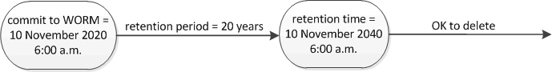

= 设置保留时间概述
:icons: font
:imagesdir: ../media/

[role="lead"]
您可以明确设置文件的保留时间，也可以使用卷的默认保留期限来派生保留时间。除非明确设置保留时间，否则 SnapLock 将使用默认保留期限来计算保留时间。

== 关于保留期限和保留时间

WORM 文件的 _retention period_ 用于指定文件提交到 WORM 状态后必须保留的时间长度。WORM 文件的 _retention time_ 是指文件不再需要保留的时间。例如，对于在 2020 年 11 月 10 日早上 6 ： 00 提交到 WORM 状态的文件，保留期限为 20 年将使保留时间为 2040 年 11 月 10 日早上 6 ： 00

[NOTE]
====
从 ONTAP 9.10.1 开始，您可以将保留时间设置为 3058 年 10 月 26 日之前的保留时间，并将保留期限设置为 100 年之前的保留期限。延长保留日期后，较早的策略将自动转换。在 ONTAP 9.9.1 及更早版本中，除非将默认保留期限设置为无限，否则支持的最大保留时间为 2071 年 1 月 19 日（ GMT ）。

====

== 重要的还原注意事项

如果存在保留期限晚于 2071 年 1 月 19 日上午 8 ： 44 ： 07 的任何文件，则 ONTAP 会阻止您将集群从 ONTAP 9.10.1 还原到早期的 ONTAP 版本。

== 了解默认保留期限

SnapLock Compliance 或 Enterprise 卷具有四个保留期限：

* 最短保留期限（ `m以` 为单位），默认值为 0
* 最长保留期限（ `max` ），默认为 30 年
* 默认保留期限，从 ONTAP 9.10.1 开始，合规模式和企业模式的默认保留期限均等于 `min` 。在 ONTAP 9.10.1 之前的 ONTAP 版本中，默认保留期限取决于模式：
+
** 对于合规模式，默认值等于 `max` 。
** 对于企业模式，默认值等于` 中的 `m。

* 未指定保留期限。
+
从 ONTAP 9.8 开始，您可以将卷中文件的保留期限设置为 `unspecified` ，以便在设置绝对保留时间之前保留该文件。您可以将绝对保留时间设置为未指定的保留时间的文件，并将其恢复为绝对保留时间，前提是新的绝对保留时间晚于先前设置的绝对时间。

因此，如果在将 Compliance 模式文件提交到 WORM 状态之前未明确设置保留时间，并且未修改默认值，则此文件将保留 30 年。同样，如果在将企业模式文件提交到 WORM 状态之前未明确设置保留时间，并且未修改默认值，则此文件将保留 0 年，或者实际上根本不保留。
