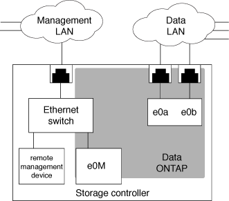

= 隔离管理网络流量
:allow-uri-read: 
:icons: font
:imagesdir: ../media/

[role="lead"]
最好在专用于管理流量的子网上配置 SP/BMC 和 e0M 管理接口。通过管理网络运行数据流量可能会导致发生原因性能下降并出现路由问题。

大多数存储控制器上的管理以太网端口（由机箱背面的扳手图标指示）连接到内部以太网交换机。内部交换机可连接到 SP/BMC 和 e0M 管理接口，您可以使用此接口通过 Telnet ， SSH 和 SNMP 等 TCP/IP 协议访问存储系统。

如果您计划同时使用远程管理设备和 e0M ，则必须在同一 IP 子网上对其进行配置。由于这些接口是低带宽接口，因此最佳做法是在专用于管理流量的子网上配置 SP/BMC 和 e0M 。

如果无法隔离管理流量，或者专用管理网络异常庞大，则应尽量减少网络流量。传入广播或多播流量过多可能会降低 SP/BMC 性能。

[NOTE]
====
某些存储控制器（例如 AFF A800 ）具有两个外部端口，一个用于 BMC ，另一个用于 e0M 。对于这些控制器，无需在同一 IP 子网上配置 BMC 和 e0M 。

====