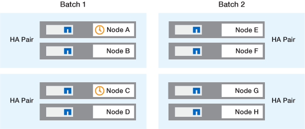
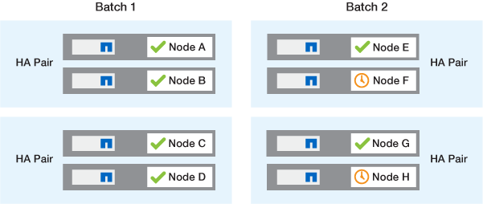

= ONTAP软件升级方法
:allow-uri-read: 
:icons: font
:imagesdir: ../media/

[role="lead"]
您可以使用系统管理自动升级ONTAP软件。或者、您也可以使用ONTAP命令行界面(CLI)执行自动或手动升级。用于升级ONTAP的方法取决于您的配置、当前ONTAP版本以及集群中的节点数。NetApp建议使用System Manager执行自动升级、除非您的配置需要使用其他方法。例如、如果您的MetroCluster配置包含4个节点且运行ONTAP 9.3或更高版本、则应使用System Manager执行自动升级(有时称为自动无中断升级或ANDU)。如果您的MetroCluster配置包含8个节点且运行ONTAP 9.2或更早版本、则应使用命令行界面执行手动升级。

可以使用滚动升级过程或批量升级过程执行升级。两者都是无中断的。

对于自动升级、ONTAP会自动在每个节点上安装目标ONTAP映像、并验证集群组件以确保集群可以无中断升级、然后根据节点数量在后台执行批量升级或滚动升级。对于手动升级、管理员手动确认集群中的每个节点均已做好升级准备、然后执行步骤以执行滚动升级。

.ONTAP滚动升级
对于少于8个节点的集群、默认情况下会执行滚动升级过程。  在滚动升级过程中、节点将脱机并进行升级、而其配对节点将接管其存储。节点升级完成后、配对节点会将控制权交还给原始所属节点、并在配对节点上重复此过程。每个附加 HA 对都会按顺序进行升级，直到所有 HA 对都运行目标版本为止。

.ONTAP批量升级
对于包含8个或更多节点的集群、默认执行批量升级过程。  在批量升级过程中、集群分为两批。  每个批处理都包含多个HA对。在第一批中、每个HA对的第一个节点会与该批中所有其他HA对的第一个节点同时进行升级。

在以下示例中、每个批处理中有两个HA对。  开始批量升级时、节点A和节点C将同时升级。

每个HA对的第一个节点升级完成后、批处理1中的配对节点将同时升级。

在以下示例中、节点A和节点C升级后、节点B和节点D将同时升级。

image::../media/batch_upgrade_set_2_ieops-1619.png[批量升级步骤2.]

然后、对批处理2中的节点重复此过程；每个HA对的第一个节点将与该批处理中所有其他HA对的第一个节点同时进行升级。

在以下示例中、节点E和节点G会同时升级。

image::../media/batch_upgrade_set_3_ieops-1612.png[批量升级步骤3.]

完成每个HA对的第一个节点的升级后、将同时升级批处理2中的配对节点。

在以下示例中、节点F和节点H会同时升级以完成批量升级过程。

== 根据配置推荐的ONTAP升级方法

您的配置支持的升级方法将按建议用法的顺序列出。

[cols="4"]
|===
| Configuration | ONTAP 版本 | 节点数 | 建议的升级方法 

| 标准 | 9.0或更高版本 | 2个或更多  a| 
* xref:task_upgrade_andu_sm.html[使用 System Manager 实现自动化无中断]
* xref:task_upgrade_andu_cli.html[使用命令行界面自动实现无中断]

| 标准 | 9.0或更高版本 | 单个 | xref:task_upgrade_disruptive_automated_cli.html[自动化中断] 

| MetroCluster | 9.3或更高版本 | 8.  a| 
* xref:task_upgrade_andu_cli.html[使用命令行界面自动实现无中断]
* xref:task_updating_a_four_or_eight_node_mcc.html[使用命令行界面手动为4节点或8节点MetroCluster无中断运行]

| MetroCluster | 9.3或更高版本 | 2 ， 4  a| 
* xref:task_upgrade_andu_sm.html[使用 System Manager 实现自动化无中断]
* xref:task_upgrade_andu_cli.html[使用命令行界面自动实现无中断]

| MetroCluster | 9.2 或更早版本 | 4 ， 8. | xref:task_updating_a_four_or_eight_node_mcc.html[使用命令行界面手动为4节点或8节点MetroCluster无中断运行] 

| MetroCluster | 9.2 或更早版本 | 2. | xref:task_updating_a_two_node_metrocluster_configuration_in_ontap_9_2_and_earlier.html[使用命令行界面为双节点MetroCluster手动无中断运行] 
|===
无论配置如何、对于所有修补程序升级、建议使用System Manager进行ANDU升级。

NOTE: 答 xref:task_updating_an_ontap_cluster_disruptively.html[手动中断升级] 可在任何配置上执行。  但是，除非您可以在升级期间使集群脱机，否则不应执行中断升级。如果您在 SAN 环境中运行，则在执行中断升级之前，应准备关闭或暂停所有 SAN 客户端。使用 ONTAP 命令行界面执行中断升级。
