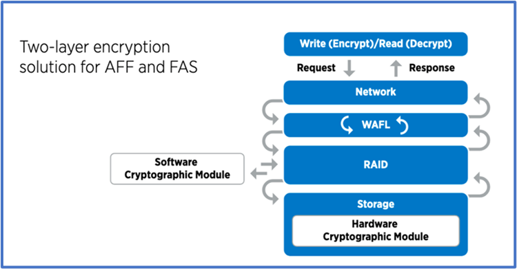

= 借助ONTAP设计以数据为中心的零信任方法
:allow-uri-read: 
:icons: font
:imagesdir: ../media/

[role="lead"]
零信任网络由以数据为中心的方法定义、其中安全控制应尽可能接近数据。ONTAP的功能与NetApp FPolicy合作伙伴生态系统相结合、可以为以数据为中心的零信任模式提供必要的控制。

ONTAP是NetApp提供的安全丰富的数据管理软件、FPolicy零信任引擎是行业领先的ONTAP功能、可提供基于文件的粒度事件通知界面。NetApp FPolicy合作伙伴可以使用此接口更好地了解ONTAP中的数据访问。

image::../media/zero-trust-architecture.png[零信任架构图]

== 构建以零信任数据为中心的MCAP

要构建以数据为中心的零信任MCAP、请执行以下步骤：

. 确定所有组织数据的位置。
. 对数据进行分类。
. 安全地处置不再需要的数据。
. 了解哪些角色应有权访问数据分类。
. 应用最小特权原则以强制实施访问控制。
. 对管理访问和数据访问使用多因素身份验证。
. 对空闲数据和传输中的数据使用加密。
. 监控和记录所有访问。
. 对可疑访问或行为发出警报。

=== 确定所有组织数据的位置

借助ONTAP的FPolicy功能以及FPolicy合作伙伴的NetApp联盟合作伙伴生态系统、您可以确定贵组织的数据位于何处以及谁有权访问这些数据。这是通过用户行为分析来实现的、该分析可确定数据访问模式是否有效。有关用户行为分析的更多详细信息、请参见监控和记录所有访问。如果您不了解数据位于何处以及谁有权访问数据、用户行为分析可以提供一个基线、用于根据经验观察结果构建分类和策略。

=== 对数据进行分类

在零信任模型的术语中、数据分类涉及有毒数据的识别。有毒数据是指不打算在组织外部公开的敏感数据。泄露有毒数据可能会违反法规、并损害组织的声誉。在合规性方面，有毒数据包括的持卡人数据 https://www.netapp.com/us/media/tr-4401.pdf["支付卡行业数据安全标准（ PCI-DSS ）"^]、欧盟的个人数据 https://www.netapp.com/us/info/gdpr.aspx["《一般数据保护条例》(GDPR)"^]或的医疗保健数据 https://www.hhs.gov/hipaa/for-professionals/privacy/laws-regulations/index.html["健康保险携带和责任法案(HIPAA)"^]。您可以使用AI驱动的工具包NetApp https://bluexp.netapp.com/netapp-cloud-data-sense["BlueXP分类"^] (以前称为Cloud Data Sense)自动扫描、分析数据并对数据进行分类。

=== 安全地处置不再需要的数据

对组织的数据进行分类后、您可能会发现某些数据不再需要或与组织的功能无关。保留不必要的数据是一项责任、应删除此类数据。有关以加密方式擦除数据的高级机制、请参见空闲数据加密中的安全清除说明。

=== 了解哪些角色应有权访问数据分类、并应用最小特权原则来强制实施访问控制

映射对敏感数据的访问权限并应用最小特权原则意味着、您的组织中的人员只能访问执行其工作所需的数据。此过程涉及基于角色的访问控制 (https://docs.netapp.com/us-en/ontap/authentication/index.html["RBAC"^]，适用于数据访问和管理访问。

借助ONTAP、可以使用Storage Virtual Machine (SVM)对ONTAP集群中租户的组织数据访问进行分段。RBAC可应用于对SVM的数据访问和管理访问。也可以在集群管理级别应用RBAC。

除了RBAC之外，您还可以使用ONTAP link:../multi-admin-verify/index.html["多管理员验证"] (MAV)来要求一个或多个管理员批准或等命令 `volume delete` `volume snapshot delete`。启用MAV后、修改或禁用MAV需要获得MAV管理员的批准。

保护Snapshot副本的另一种方法是使用ONTAP link:../snaplock/snapshot-lock-concept.html["Snapshot副本锁定"]。Snapshot副本锁定是一项SnapLock功能、通过此功能、可以手动或自动将Snapshot副本呈现为不可删除的卷Snapshot副本策略保留期限。Snapshot副本锁定也称为防篡改Snapshot副本锁定。Snapshot副本锁定的目的是防止恶意或不可信的管理员删除主ONTAP系统和二级Snapshot系统上的Snapshot副本。可以快速恢复主系统上锁定的Snapshot副本、以便还原被勒索软件损坏的卷。

=== 对管理访问和数据访问使用多因素身份验证

除了集群管理RBAC之外、 https://www.netapp.com/us/media/tr-4647.pdf["多因素身份验证(MFA)"^] 还可以部署ONTAP Web管理访问和安全Shell (SSH)命令行访问。对于美国公共部门组织或必须遵循PCI-DSS的组织、管理访问的MFA是一项要求。MFA使攻击者无法仅使用用户名和密码来攻击帐户。MFA需要两个或更多独立因素进行身份验证。双因素身份验证的一个示例是用户拥有的信息(例如私钥)和用户知道的信息(例如密码)。通过安全断言标记语言(SAML) 2.0、可以通过Web对ONTAP系统管理器或ActiveIQ统一管理器进行管理访问。SSH命令行访问使用具有公共密钥和密码的链式双因素身份验证。

您可以使用ONTAP中的身份和访问管理功能通过API控制用户和计算机访问：

* 用户：
+
** *身份验证和授权。*通过适用于SMB和NFS的NAS协议功能。
** *审计*访问和事件系统日志。CIFS协议的详细审核日志记录、用于测试身份验证和授权策略。对文件级的详细NAS访问进行精细粒度FPolicy审核。

* 设备：
+
** *身份验证。*基于证书的API访问身份验证。
** *授权默认或自定义基于角色的访问控制(Role-Based Access Control、RBAC)。
** *审计*已执行的所有操作的系统日志。

=== 对空闲数据和传输中的数据使用加密

==== 空闲数据加密

每天、当企业重新利用驱动器、退回有缺陷的驱动器或通过销售或以旧换新方式升级到更大的驱动器时、要缓解存储系统风险和基础架构缺口、都有新的要求。 作为数据管理员和操作员、存储工程师应在数据的整个生命周期内安全地管理和维护数据。 https://www.netapp.com/us/media/ds-3898.pdf["NetApp存储加密(NSE)#44；NetApp卷加密(NVE)#44；以及NetApp聚合加密"^] 帮助您始终对空闲数据进行加密、无论数据是否有毒、而且不会影响日常运营。 https://www.netapp.com/us/media/ds-3213-en.pdf["NSE"^] 是一款ONTAP硬件 link:../encryption-at-rest/index.html["空闲数据"] 解决方案、使用经过FIPS 140-2 2级验证的自加密驱动器。 https://www.netapp.com/us/media/ds-3899.pdf["NVE和NAE"^] 是利用的ONTAP软件 link:../encryption-at-rest/index.html["空闲数据"] 解决方案 https://csrc.nist.gov/projects/cryptographic-module-validation-program/certificate/4144["FIPS 140-2 1级验证的NetApp加密模块"^]。使用NVE和NAE时、可以使用硬盘驱动器或固态驱动器进行空闲数据加密。此外、NSE驱动器可用于提供本机分层加密解决方案、以提供加密冗余和额外的安全性。如果违反了一个层、则第二个层仍可保护数据的安全。这些功能使ONTAP非常适合 https://www.netapp.com/us/media/sb-3952.pdf["量子就绪加密"^]。

NVE还提供了一项功能、称为 https://blog.netapp.com/flash-memory-summit-award/["安全清除"^] 在将敏感文件写入非分类卷时以加密方式删除数据泄漏中的有毒数据。

link:../encryption-at-rest/support-storage-encryption-concept.html["板载密钥管理器（ OKM ）"]内置在ONTAP中的密钥管理器，或者 https://mysupport.netapp.com/matrix/imt.jsp?components=69551;&solution=1156&isHWU&src=IMT["已批准"^] 第三方 link:../encryption-at-rest/support-storage-encryption-concept.html["外部密钥管理器"] 可与NSE和NVE结合使用以安全地存储密钥材料。

如上图所示、基于硬件和软件的加密可以结合使用。通过此功能 https://www.netapp.com/blog/netapp-ontap-CSfC-validation/["将ONTAP验证到NSA的分类计划商业解决方案中"^] 、可以存储顶级机密数据。

==== 传输中数据加密

ONTAP传输中数据加密可保护用户数据访问和控制平台访问。对于Microsoft CIFS共享访问、可以使用SMB 3.0加密来加密用户数据访问；对于NFS Kerberos 5、可以使用krb5P来加密用户数据访问。对于CIFS、NFS和iSCSI、也可以使用加密用户数据访问 link:../networking/configure_ip_security_@ipsec@_over_wire_encryption.html["IPsec"] 。控制平面访问使用传输层安全(Transport Layer Security、TLS)进行加密。ONTAP为控制平面访问提供了 https://docs.netapp.com/us-en/ontap-cli//security-config-modify.html["FIPS"^] 合规模式、该模式可启用FIPS批准的算法、并禁用未经FIPS批准的算法。数据复制使用进行加密 link:../peering/enable-cluster-peering-encryption-existing-task.html["集群对等加密"]。这样可以为ONTAP SnapVault和SnapMirror技术提供加密功能。

=== 监控和记录所有访问

在实施RBAC策略后、您必须部署主动监控、审核和警报。NetApp ONTAP的FPolicy零信任引擎与相结合 https://www.netapp.com/partners/partner-connect["NetApp FPolicy合作伙伴生态系统"^]，为以数据为中心的零信任模型提供了必要的控制。NetApp ONTAP是一款安全丰富的数据管理软件、 link:../nas-audit/two-parts-fpolicy-solution-concept.html["fpolicy"] 是行业领先的ONTAP功能、可提供基于文件的粒度事件通知界面。NetApp FPolicy合作伙伴可以使用此接口更好地了解ONTAP中的数据访问。借助ONTAP的FPolicy功能以及FPolicy合作伙伴的NetApp联盟合作伙伴生态系统、您可以确定组织数据的位置以及谁有权访问这些数据。这是通过用户行为分析来实现的、该分析可确定数据访问模式是否有效。用户行为分析可用于针对异常模式下的可疑或异常数据访问发出警报、并在必要时采取措施拒绝访问。

FPolicy合作伙伴正在从用户行为分析转向机器学习(ML)和人工智能(AI)、以提高事件保真度并减少误报(如果有)。所有事件都应记录到系统日志服务器或安全信息和事件管理(SIEM)系统、该系统也可以使用ML和AI。

image::../media/zero-trust-fpolicy-architecture.png[fPolicy架构图]

NetApp的存储工作负载安全性(以前称为 https://docs.netapp.com/us-en/cloudinsights/cs_intro.html["Cloud Secure"^])可利用FPolicy界面以及云端和内部ONTAP存储系统上的用户行为分析、为您提供有关恶意用户行为的实时警报。存储工作负载安全性通过高级机器学习和异常检测、防止组织数据被恶意用户或被入侵用户滥用。存储工作负载安全性可以识别勒索软件攻击或其他不当行为、调用Snapshot副本并隔离恶意用户。存储工作负载安全性还具有取证功能、可查看用户和实体活动的详细信息。存储工作负载安全性是NetApp Cloud Insights的一部分。

除了存储工作负载安全性之外、ONTAP还具有板载勒索软件检测功能、称为 link:../anti-ransomware/index.html["自主勒索软件保护"] (ARP)。ARP使用机器学习来确定异常文件活动是否指示正在发生勒索软件攻击、并调用Snapshot副本并向管理员发出警报。存储工作负载安全性与ONTAP集成以接收ARP事件、并提供额外的分析和自动响应层。
